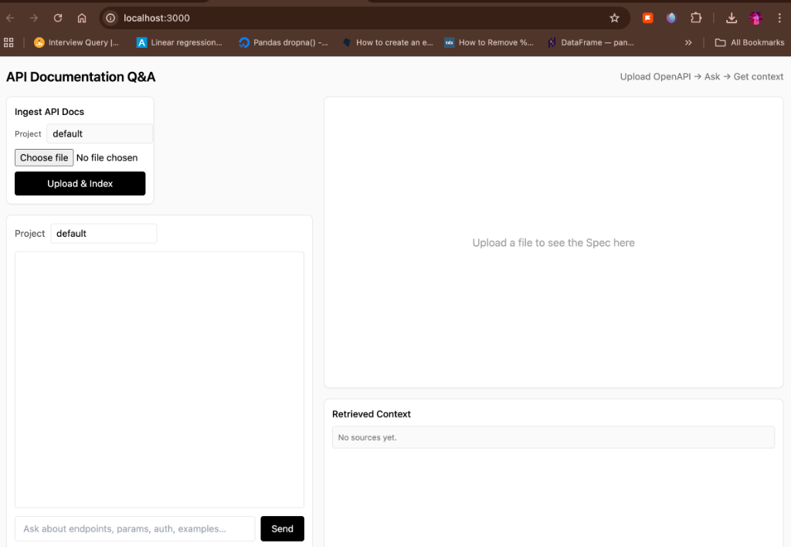

# API Documentation Q&A Portal

An intelligent, RAG-powered portal that allows developers to **upload API documentation** (OpenAPI/Swagger or Markdown) and **ask questions** about it. The system provides precise answers with citations and lets you visualize the API Spec side-by-side.



## 🚀 Key Features

*   **Smart Ingestion**: Parses `openapi.json/yaml` into granular endpoint chunks for high-precision retrieval.
*   **RAG Pipeline**: Retrieves relevant documentation context to answer user queries (e.g., "How do I authenticate?" or "What params does GET /users take?").
*   **Split-Screen Spec Viewer**: Automatically renders the uploaded OpenAPI spec in a **Swagger UI** panel alongside the chat.
*   **Rich Chat Interface**: Supports Markdown rendering and Code Syntax Highlighting.
*   **Smart Citations**: Answers cite the specific source endpoint (e.g., `GET /api/v1/projects`).

## 🛠️ Tech Stack

*   **Backend**: Python, FastAPI, ChromaDB (Vector Store), Sentence-Transformers (Embeddings).
*   **Frontend**: Next.js (React), TailwindCSS, Swagger UI React.
*   **LLM**: OpenAI (GPT-4o/mini) or Anthropic (Claude).

---

## 📥 Input Requirements

The system accepts the following file formats for ingestion:

### 1. OpenAPI Specification (`.json`, `.yaml`, `.yml`)
The most supported format. The parser extracts:
*   **Endpoints** (Method + Path)
*   **Operation ID** & Summary
*   **Parameters** (Query, Path, Body)
*   **Responses**
*   **Schemas**

**Example Structure:**
```json
{
  "openapi": "3.0.0",
  "info": { "title": "My API", "version": "1.0.0" },
  "paths": {
    "/users": {
      "get": {
        "summary": "List users",
        "operationId": "listUsers",
        ...
      }
    }
  }
}
```

### 2. Markdown / Text (`.md`, `.txt`)
Generic documentation files.
*   Parsed as a single text chunk (for now) or split by headers if formatted correctly.
*   Useful for "Getting Started" guides or Authentication overviews that aren't in the OpenAPI spec.

---

## 📤 Output Details

When you ask a question, the system produces:

1.  **Direct Answer**: A natural language explanation generated by the LLM.
2.  **Code Examples**: `curl` or Python/JS snippets if requested.
3.  **Sources/Citations**: A list of retrieved context chunks used to generate the answer.
    *   *Format*: `Endpoint: GET /users | Distance: 0.42`
4.  **Raw Spec Visualization**: The right-hand panel displays the interactive Swagger UI for the referenced file.

---

## 🏁 Getting Started

### Prerequisites
*   Python 3.9+
*   Node.js 18+
*   Docker (Optional)
*   OpenAI API Key

### 1. Backend Setup
```bash
# Create venv
python -m venv .venv
source .venv/bin/activate

# Install deps
pip install -r requirements.txt

# Run Server
export OPENAI_API_KEY="sk-..."
uvicorn src.api.main:app --reload
# Backend running at http://localhost:8000
```

### 2. Frontend Setup
```bash
cd web
npm install
npm run dev
# Frontend running at http://localhost:3000
```

---

## 🔮 Future Roadmap

*   [ ] **Multi-File Projects**: Allow uploading multiple files (e.g., Spec + Markdown Guide) into a single "Project" context.
*   [ ] **Authentication**: User accounts to save chat history and private documentation.
*   [ ] **Parsing Improvements**: Better chunking for large Markdown files.
*   [ ] **Interactive "Try It"**: Execute API calls directly from the Chat interface using the generated `curl` commands.
*   [ ] **Local LLM Support**: Full integration with Ollama/LlamaCPP for offline usage.
