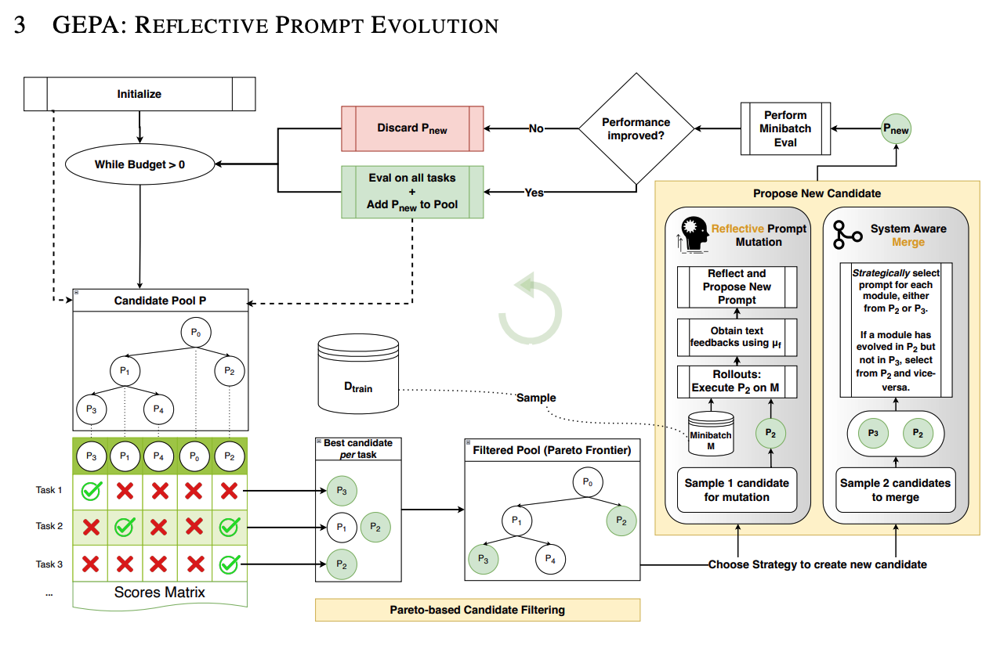

Prompt Optimization Product Experience & Approaches
Why this track exists

There are three product initiatives underway to address the friction customers experience when migrating prompts to GPT-5.x. Initiative #2 is production-ready and needs customer validation, while Initiative #3 remains experimental for advanced teams. Our goal is to give facilitators a crisp recommendation for how customers should optimize and migrate their prompts.
Overview
We have several tools and approaches in development that build on each other. Use this page to brief customers before they dive into the lab:
Initiative 1 — Heuristic-based prompting tool
Separate interface where customers can experiment with prompts and optimize for GPT-5 use cases.
Ideal starting point when a customer only has an input prompt or early use case in mind and has not set up evals yet.
Supports early-stage GenAI experimentation and migrations from other model providers. Prompt + parameter tuning (for example, Juice = 8) has produced reliable improvements for several pilots.
Who should use it?

Early-stage customers testing GenAI ideas.
Teams with existing prompts on other providers that must migrate to GPT-5.x.
Builders who want to explore multiple model/provider combinations without committing to eval infrastructure yet.
Initiative 2 — Eval-based Prompt Optimizer tooling

<iframe width="1102" height="619" src="https://www.youtube.com/embed/jrvE0FREri0" title="Prompt Optimization Approaches" frameborder="0" allow="accelerometer; autoplay; clipboard-write; encrypted-media; gyroscope; picture-in-picture; web-share" referrerpolicy="strict-origin-when-cross-origin" allowfullscreen></iframe>
Intermediate users who understand golden data and can provide datasets move here.
Heuristic optimization: Capture the best prompt + parameter bundle from Initiative 1.
Dataset integration: Feed the optimized prompt into the datasets/Prompt Optimizer tool after running graders.
Eval loop: Use the workspace as a catalyst for rapid eval/grader iteration and to surface regression notes.
The diagram below illustrates the iterative process for continuously improving an AI agent through feedback, meta prompting, and evaluation. The loop combines human judgment or automated feedback using an LLM-as-a-judge to iteratively enhance performance.self_loop
Resources

Video walkthrough: Watch the embedded Optimizing Prompts for Enhanced Equity Research Outputs session below for a deeper look at Initiatives 1 & 2.

Initiative 3 — System-level process (GEPA)
Advanced teams can apply the GEPA prompt optimization method, which works backward from eval results to refine prompts.
Start from the eval outcomes gathered in Initiative 2.
Follow the loop: Gather → Explore → Plan → Apply.
Document which eval metrics improve and which regressions remain before production rollout.
GEPA follows an iterative process: in each round, it generates a new candidate by improving upon existing ones using one of two strategies—Reflective Prompt Mutation or System Aware Merge. Each new candidate is first evaluated on a small batch of data (a minibatch); if it performs well, it is then evaluated on a larger dataset.
Unlike approaches that always select the single top-performing candidate for the next mutation—which can cause stagnation in a local optimum—GEPA uses Pareto-based candidate sampling. This method filters and samples from the best candidates across different tasks, maintaining diversity in the pool.
These design choices make GEPA highly sample-efficient and enable it to generalize effectively across use cases.
GEPA Auto optimizer

Code Walkthrough
A complete guide covering all approaches is published here. We will walkthrough the material and showcase worked examples and autonomous-agent retraining guidance.
How to prompt migrate:
Frame the migration: Explain why Initiative 2 must be tested and when to advance to Initiative 3.
Assess readiness: Place customers on the heuristic → eval → GEPA spectrum.
Collect feedback: Ask for observations about the Prompt Optimizer workspace so we can validate Initiative 2’s sufficiency.
Share findings: Summarize recommended workflows and tooling gaps back to the product team.