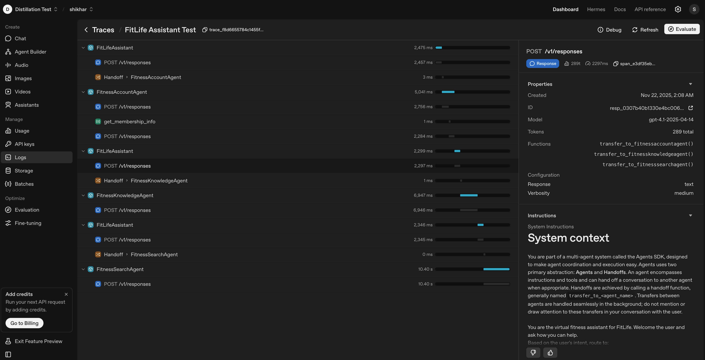

FitLife Voice Coach: Agents SDK Builder Lab
Build a voice-enabled, multi-agent assistant

Create a digital fitness-coach assistant using the OpenAI Agents SDK. You will wire multiple specialist agents, a triage router, and a voice pipeline to deliver natural, spoken answers.
Lab type

Guided build

Duration

~60 minutes

Level

Intermediate

Environment

macOS/Linux/Windows terminal

Python

3.10+

Focus

Agents SDK + Voice

Jump to

Introduction
Setup
Agents & tools
Run (text mode)
Enable voice
Optimize voice output
Custom TTS settings
Putting it together
1. Introduction
The OpenAI Responses API, Agents SDK, and Voice extensions make it straightforward to build modular voice assistants without rewriting everything for each use case. In this tutorial you will:

Create three specialist agents: SearchAgent, KnowledgeAgent, and AccountAgent for a fitness-coach scenario.
Build a TriageAgent to route user queries to the right specialist.
Test the workflow in text mode, then convert it to voice.
Optimize voice output to sound friendly and natural.
2. Setup
Install required packages (Python 3.10+ recommended):

pip install openai
pip install openai-agents "openai-agents[voice]"
pip install numpy sounddevice
Set your API key via the Agents SDK:

from agents import set_default_openai_key
set_default_openai_key("YOUR_OPENAI_API_KEY")
3. Define agents & tools (FitLife)
The assistant supports three intents: real-time fitness search, internal program knowledge, and account info.

3.1 Search Agent
from agents import Agent, WebSearchTool

search_agent = Agent(
  name="FitnessSearchAgent",
  instructions=(
      "Immediately call the WebSearchTool to find up-to-date fitness information or trends based on the user's query."
  ),
  tools=[WebSearchTool()],
)
3.2 Knowledge Agent (FileSearchTool)
from agents import FileSearchTool
from openai import OpenAI
import os

client = OpenAI(api_key="YOUR_OPENAI_API_KEY")

def create_vector_store(store_name: str) -> str:
  vs = client.vector_stores.create(name=store_name)
  return vs.id

def upload_file(file_path: str, vector_store_id: str):
  file_resp = client.files.create(file=open(file_path, 'rb'), purpose="assistants")
  client.vector_stores.files.create(vector_store_id=vector_store_id, file_id=file_resp.id)

vector_store_id = create_vector_store("FitLife Knowledge Base")
upload_file("fitlife_guides/strength_training.pdf", vector_store_id)

knowledge_agent = Agent(
  name="FitnessKnowledgeAgent",
  instructions="Answer user questions about FitLife programs with concise, helpful responses using the FileSearchTool.",
  tools=[FileSearchTool(max_num_results=3, vector_store_ids=[vector_store_id])],
)
3.3 Account Agent (custom tool)
from agents import function_tool

@function_tool
def get_membership_info(user_id: str) -> dict:
  """Return dummy membership data for a given user."""
  return {
      "user_id": user_id,
      "name": "Jane Doe",
      "membership_level": "Platinum",
      "remaining_sessions": 8,
  }

account_agent = Agent(
  name="FitnessAccountAgent",
  instructions="Provide membership information based on a user ID using the get_membership_info tool.",
  tools=[get_membership_info],
)
3.4 Triage Agent
from agents.extensions.handoff_prompt import prompt_with_handoff_instructions

triage_agent = Agent(
  name="FitLifeAssistant",
  instructions=prompt_with_handoff_instructions("""
You are the virtual fitness assistant for FitLife. Welcome the user and ask how you can help.
Based on the user's intent, route to:
- FitnessAccountAgent for membership queries,
- FitnessKnowledgeAgent for workout or nutrition FAQs,
- FitnessSearchAgent for general fitness trends or real-time info.
"""),
  handoffs=[account_agent, knowledge_agent, search_agent],
)
4. Run the workflow (text mode)
Test routing and outputs before adding voice:

from agents import Runner, trace
import asyncio

async def test_queries():
  examples = [
      "What is my remaining session count? My user ID is 12345",
      "Tell me about the FitLife strength-training program.",
      "What fitness trends are popular right now?",
  ]
  with trace("FitLife Assistant Test"):
      for query in examples:
          result = await Runner.run(triage_agent, query)
          print(f"User: {query}\n{result.final_output}\n---")

asyncio.run(test_queries())
Inspect runs in the Traces dashboard to confirm correct handoffs as shown below.

traces_dashboard
5. Enable voice
Use the Agents SDK voice pipeline to capture mic input and speak responses:

import numpy as np
import sounddevice as sd
from agents.voice import AudioInput, SingleAgentVoiceWorkflow, VoicePipeline
from agents import trace
import asyncio

async def voice_assistant():
  samplerate = sd.query_devices(kind='input')['default_samplerate']
  while True:
      pipeline = VoicePipeline(workflow=SingleAgentVoiceWorkflow(triage_agent))
      cmd = input("Press Enter to speak your query (or type 'esc' to exit): ")
      if cmd.lower() == "esc":
          print("Exiting...")
          break
      print("Listening...")
      recorded_chunks = []
      with sd.InputStream(samplerate=samplerate, channels=1, dtype='int16',
                          callback=lambda indata, frames, time, status:
                          recorded_chunks.append(indata.copy())):
          input()  # Wait until Enter is pressed
      recording = np.concatenate(recorded_chunks, axis=0)
      audio_input = AudioInput(buffer=recording)
      with trace("FitLife Voice Assistant"):
          result = await pipeline.run(audio_input)
      response_chunks = []
      async for event in result.stream():
          if event.type == "voice_stream_event_audio":
              response_chunks.append(event.data)
      response_audio = np.concatenate(response_chunks, axis=0)
      print("Assistant responding...")
      sd.play(response_audio, samplerate=samplerate)
      sd.wait()
      print("---")

asyncio.run(voice_assistant())
6. Optimize voice output
Apply a common voice system prompt to make spoken answers concise and friendly:

voice_system_prompt = """
[Output Structure] Your output will be delivered in an audio voice response.
Please ensure every response meets these guidelines:
1. Use a friendly, human tone that will sound natural when spoken aloud.
2. Keep responses short—one or two concise sentences.
3. Avoid technical jargon; use plain language.
4. Provide only essential details.
"""
Create voice-tuned agents and a triage voice agent:

search_voice_agent = Agent(
  name="FitnessSearchVoiceAgent",
  instructions=voice_system_prompt + "You immediately call WebSearchTool on the user's fitness query.",
  tools=[WebSearchTool()],
)

knowledge_voice_agent = Agent(
  name="FitnessKnowledgeVoiceAgent",
  instructions=voice_system_prompt + "You answer user questions about FitLife programs using the FileSearchTool.",
  tools=[FileSearchTool(max_num_results=3, vector_store_ids=[vector_store_id])],
)

account_voice_agent = Agent(
  name="FitnessAccountVoiceAgent",
  instructions=voice_system_prompt + "You provide membership information based on a user ID using the get_membership_info tool.",
  tools=[get_membership_info],
)

triage_voice_agent = Agent(
  name="FitLifeVoiceAssistant",
  instructions=prompt_with_handoff_instructions("""
You are the virtual assistant for FitLife. Welcome the user and ask how you can help.
Based on intent, route to:
- FitnessAccountAgent for membership queries
- FitnessKnowledgeAgent for workout FAQs
- FitnessSearchAgent for real-time fitness info
"""),
  handoffs=[account_voice_agent, knowledge_voice_agent, search_voice_agent],
)
6.1 Customize TTS settings
Personalize speech output with TTSModelSettings and VoicePipelineConfig:

from agents.voice import TTSModelSettings, VoicePipelineConfig

custom_tts_settings = TTSModelSettings(
  instructions=(
      "Personality: supportive, encouraging fitness coach. "
      "Tone: energetic yet patient. "
      "Tempo: moderate with natural pauses. "
      "Emotion: upbeat and positive."
  )
)

voice_pipeline_config = VoicePipelineConfig(tts_settings=custom_tts_settings)
Pass this config when constructing VoicePipeline to align voice with your brand.

7. Putting it all together
Specialized agents for search, knowledge retrieval, and account tasks.
A triage agent that routes by intent and supports handoffs.
Text mode workflow validated with traces.
Voice-enabled assistant that transcribes, routes, and speaks.
Voice tuning via a shared system prompt and TTS settings.
The modular Agents SDK approach lets you add new agents without rewriting the system. Start in text, trace, iterate prompts/tools, then graduate to voice.