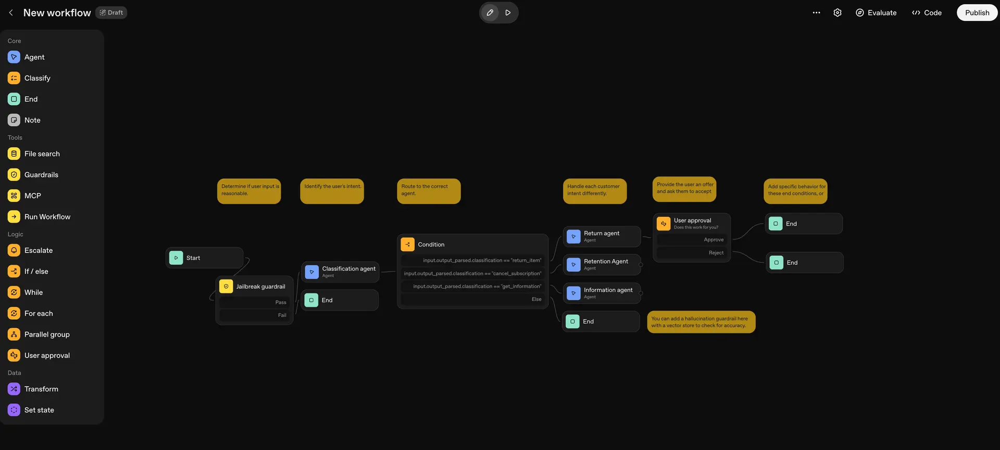

Getting Started with Agent Builder: Step-by-Step Tutorial
Lab type

Guided tutorial

Duration

~30 minutes

Level

New AgentKit builders

Environment

Agent Builder UI

Surfaces

ChatGPT / ChatKit

Focus

Visual agent creation

Jump to

Getting started
Step 1
Step 2
Step 3
Step 4
Step 5
Step 6
Step 7
Iteration tip
1. Getting started
This guide walks you through running the Agent Builder for the first time using a template from OpenAI's platform.

2. Navigate to the OpenAI Platform
Go to platform.openai.com and sign in with your OpenAI account.

3. Access the Agent Builder
Once logged in, look for the navigation menu on the left side of the dashboard.
Click on Agent builder. This will take you to the main Agent Builder workspace.
4. Select a template
Within the Agent builder page, click on "Templates" tab.
A list of available templates will appear.
Browse the templates and select the "Customer Service" template. This is a great starting point for building customer support agents as shown below.

OpenAI Agent Builder: Customer Service Template Selection Screenshot
5. Open the template
Click on "Customer Service Flow". The template will open, showing its pre-configured steps and logic.
Take a moment to review the template structure, cards, and possible customer interactions defined for you.
6. Run an evaluation on traces
At the top of the Agent Builder interface, find the Evaluation or Traces tab.
Click to view traces—these are records of test conversations or flows.
Run an evaluation on the traces to see how the agent performs. This will help you understand and improve the agent’s responses and logic.
7. Preview the application
After evaluating the agent, click the "Preview" button.
This opens a live sandbox where you can interact with the agent as a user would.
Test different queries and workflows to verify everything works as expected.
8. Publish to ChatGPT (ChatKit)
Once satisfied, look for the "Publish" option.
Follow the prompt to publish your agent to ChatKit, making it accessible through OpenAI’s chat interface or your desired endpoint.
9. Iterate frequently
Tip

Iterate as needed! You can refine your agent, re-run evaluations, and preview before final publishing.