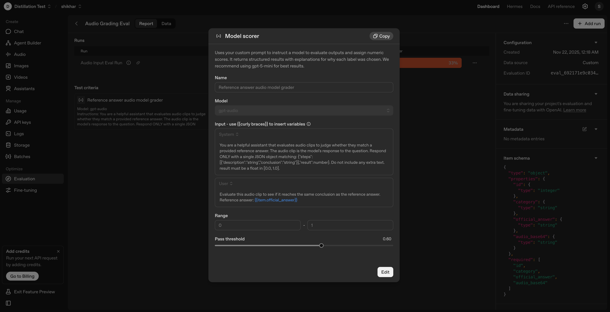
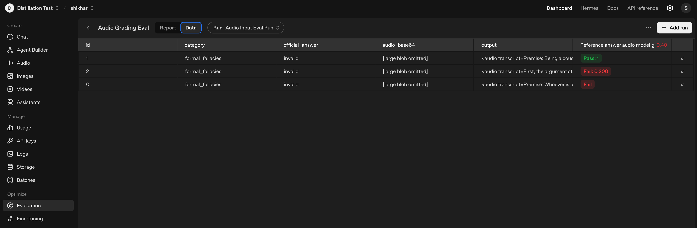

Audio Evals with OpenAI
Audio evals guide

Follow the steps below, then tackle the coding challenge to finish the evaluation setup.
Lab type

Guided tutorial

Duration

~45 minutes

Level

Intermediate

Modalities

Audio + Text

Python

3.10+

Learning objectives
By the end of this tutorial you will:
Install the dependencies for running audio-based evals.
Prepare an audio dataset and convert audio files to base64.
Configure an OpenAI Evals evaluation with the right schema and grader.
Run an evaluation using audio inputs and poll the results.
Analyze the results and consider next steps.
Complete a coding challenge that asks you to finish key helpers and refine the eval.
Step-by-step tutorial
1) Install dependencies and set up
Create requirements.txt file with the following packages:
openai
# `datasets` 4.x pulls in torchcodec; pin to pre-4 to keep soundfile-based audio decoding
datasets<4
pandas
soundfile
torch
pydub
jiwer
# numpy 2.x causes ABI issues with current torch; keep it on 1.x
numpy<2
librosa
Install the Python packages needed for audio evals:
pip install -r requirements.txt 

Import the packages:
from datasets import load_dataset, Audio
from openai import OpenAI
import base64
import os
import json
import time
import io
import soundfile as sf
import numpy as np
import pandas as pd
Set OPENAI_API_KEY in your environment so the SDK can authenticate.
2) Prepare the dataset
Load the Big Bench Audio dataset from Hugging Face and decode the audio column:
dataset = load_dataset("ArtificialAnalysis/big_bench_audio")
dataset = dataset.cast_column("audio", Audio(decode=True))
The dataset provides spoken logic puzzles with categories and official answers, which makes it a good fit for testing reasoning on audio inputs.
3) Convert audio to base64
OpenAI Evals expects base64-encoded audio. Use the helper functions below to cover common cases (file paths, decoded arrays, and raw bytes):
def get_base64(audio_path_or_datauri: str) -> str:
    if audio_path_or_datauri.startswith("data:"):
        return audio_path_or_datauri.split(",", 1)[1]
    else:
        with open(audio_path_or_datauri, "rb") as f:
            return base64.b64encode(f.read()).decode("ascii")

def audio_to_base64(audio_val) -> str:
    try:
        path = None
        if isinstance(audio_val, dict) and "path" in audio_val:
            path = audio_val["path"]
        else:
            path = getattr(audio_val, "path", None)
        if isinstance(path, str) and os.path.exists(path):
            with open(path, "rb") as f:
                return base64.b64encode(f.read()).decode("ascii")
    except Exception:
        pass
    try:
        array = None
        sampling_rate = None
        try:
            array = audio_val["array"]
            sampling_rate = audio_val["sampling_rate"]
        except Exception:
            array = getattr(audio_val, "array", None)
            sampling_rate = getattr(audio_val, "sampling_rate", None)
        if array is not None and sampling_rate is not None:
            audio_np = np.array(array)
            buf = io.BytesIO()
            sf.write(buf, audio_np, int(sampling_rate), format="WAV")
            return base64.b64encode(buf.getvalue()).decode("ascii")
    except Exception:
        pass
    if isinstance(audio_val, (bytes, bytearray)):
        return base64.b64encode(audio_val).decode("ascii")
    raise ValueError("Unsupported audio value; could not convert to base64")
4) Build the data source for evals
Sample a few items (the example uses three) and encode each audio clip:
evals_data_source = []
for example in dataset["train"].select(range(3)):
    audio_val = example["audio"]
    try:
        audio_base64 = audio_to_base64(audio_val)
    except Exception as e:
        print(f"Warning: could not encode audio for id={example['id']}: {e}")
        audio_base64 = None
    evals_data_source.append({
        "item": {
            "id": example["id"],
            "category": example["category"],
            "official_answer": example["official_answer"],
            "audio_base64": audio_base64,
        }
    })
Each item ends up with an id, category, official answer, and base64 audio blob.
5) Save and upload the data
Persist the data source to JSONL and upload it so Evals can read the audio payloads:
client = OpenAI(api_key=os.getenv("OPENAI_API_KEY"))
file_name = "evals_data_source.json"
with open(file_name, "w", encoding="utf-8") as f:
    for obj in evals_data_source:
        f.write(json.dumps(obj, ensure_ascii=False) + "\n")

uploaded_file = client.files.create(file=open(file_name, "rb"), purpose="evals")
6) Configure the evaluation
Define the data source schema and a grader. The score model grader below uses gpt-audio to judge whether the sampled audio answer matches the official answer:
data_source_config = {
    "type": "custom",
    "item_schema": {
        "type": "object",
        "properties": {
            "id": {"type": "integer"},
            "category": {"type": "string"},
            "official_answer": {"type": "string"},
            "audio_base64": {"type": "string"},
        },
        "required": ["id", "category", "official_answer", "audio_base64"],
    },
    "include_sample_schema": True
}

grader_config = {
    "type": "score_model",
    "name": "Reference answer audio model grader",
    "model": "gpt-audio",
    "input": [
        {
            "role": "system",
            "content": (
                "You are a helpful assistant that evaluates audio clips to judge "
                "whether they match a provided reference answer. The audio clip is "
                "the model's response to the question. Respond ONLY with a single JSON "
                "object matching: {\"steps\":[{\"description\":\"string\",\"conclusion\":\"string\"}],"
                "\"result\":number}. Do not include any extra text. result must be a float in [0.0, 1.0]."
            ),
        },
        {
            "role": "user",
            "content": [
                {
                    "type": "input_text",
                    "text": (
                        "Evaluate this audio clip to see if it reaches the same conclusion "
                        "as the reference answer. Reference answer: {{item.official_answer}}"
                    ),
                },
                {
                    "type": "input_audio",
                    "input_audio": {
                        "data": "{{ sample.output_audio.data }}",
                        "format": "wav",
                    },
                },
            ],
        },
    ],
    "range": [0, 1],
    "pass_threshold": 0.6,
}
eval_object = client.evals.create(
    name="Audio Grading Eval",
    data_source_config=data_source_config,
    testing_criteria=[grader_config],
)
You can swap in a simpler string_check grader if you only need a text containment check.
7) Run the evaluation
Set up sampling messages that instruct the model and include the audio input:
sampling_messages = [
    {
        "role": "system",
        "content": (
            "You are a helpful and obedient assistant that can answer questions with audio input. "
            "You will be given an audio input containing a question to answer."
        ),
    },
    {
        "role": "user",
        "type": "message",
        "content": {
            "type": "input_text",
            "text": (
                "Answer the following question by replying with brief reasoning statements "
                "and a conclusion with a single word answer: 'valid' or 'invalid'."
            ),
        },
    },
    {
        "role": "user",
        "type": "message",
        "content": {
            "type": "input_audio",
            "input_audio": {
                "data": "{{ item.audio_base64 }}",
                "format": "wav",
            },
        },
    },
]
eval_run = client.evals.runs.create(
    name="Audio Input Eval Run",
    eval_id=eval_object.id,
    data_source={
        "type": "completions",
        "source": {
            "type": "file_id",
            "id": uploaded_file.id,
        },
        "model": "gpt-audio",
        "sampling_params": {"temperature": 0.0},
        "input_messages": {
            "type": "template",
            "template": sampling_messages,
        },
        "modalities": ["audio", "text"],
    },
)
Model support

Make sure the model you choose supports audio inputs before running the eval.
8) Poll and display results
Poll the run until it completes, then load the results into a DataFrame:
while True:
    run = client.evals.runs.retrieve(run_id=eval_run.id, eval_id=eval_object.id)
    if run.status == "completed":
        output_items = list(client.evals.runs.output_items.list(run_id=run.id, eval_id=eval_object.id))
        df = pd.DataFrame({
            "id": [item.datasource_item["id"] for item in output_items],
            "category": [item.datasource_item["category"] for item in output_items],
            "official_answer": [item.datasource_item["official_answer"] for item in output_items],
            "model_response": [item.sample.output[0].content for item in output_items],
            "grading_results": ["passed" if item.results[0]["passed"] else "failed" for item in output_items],
        })
        display(df)
        break
    if run.status == "failed":
        print(run.error)
        break
    time.sleep(5)
When you navigate to the evaluation tab within the OpenAI Dashboard, you can click on Audio Grading Eval in order to monitor the progress.

Dashboard view of audio grading evaluation progress
You can also click on the Data Tab within the Audio Grading Eval run in order to dive into the individual audio input/output evaluations shown below.

Data view of audio grading evaluation progress
9) Conclusion and next steps
Adapt the evaluation to your own audio datasets and grading rubric.
Use the uploads API for longer clips (up to 8 GB).
Visualize results in the Evals dashboard to spot trends across runs.

### Coding challenge: finish the evaluation setup
Implement audio_to_base64 fully and add unit tests that cover: a WAV file path, a dict with array and sampling_rate, and a raw bytes object.
Extend the dataset sampling to load 10 examples instead of 3, gracefully skipping any items that fail to encode.
Create a custom grader that awards 1 point if the model transcript contains all words from the official answer (case insensitive) and 0 otherwise.
Run the evaluation, show the resulting DataFrame, and explain which items passed and why. Experiment with models or sampling params to see how results shift.
Share your code and findings with the cohort once you have a working run.