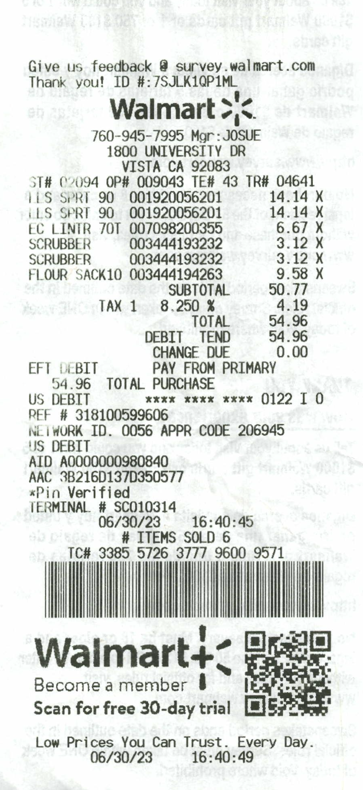
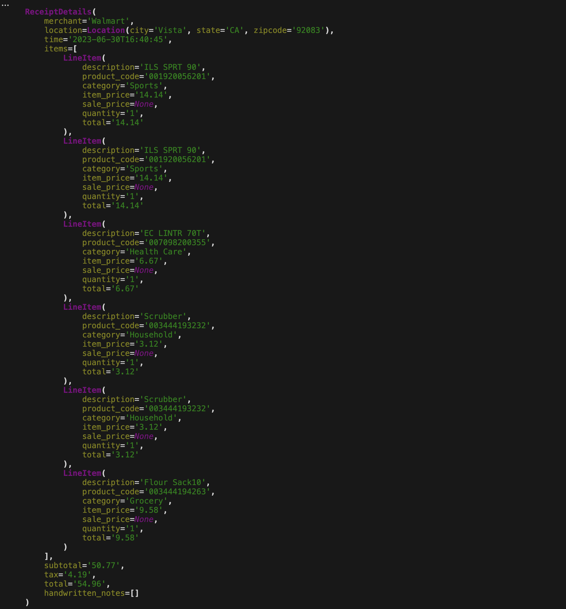
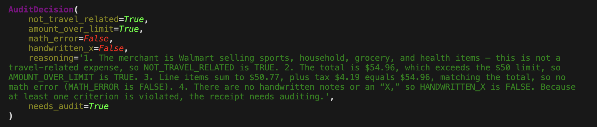
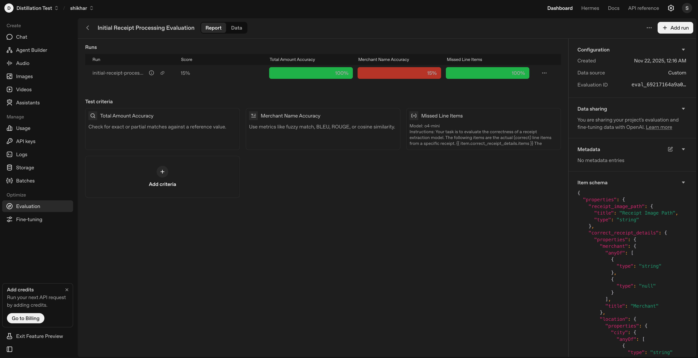

Document Inspection Use Case
Document inspection with evals API

Follow the steps to extract receipts, audit them, and wire evals to business metrics.
Lab type

Builder lab

Duration

~45 minutes

Level

Intermediate

Modalities

Vision + Text

Python

3.8+

1. Environment setup
Install required packages (OpenAI SDK, Pydantic, dotenv, Rich, Persist-Cache):
pip install --upgrade openai pydantic python-dotenv rich persist-cache -qqq
Load your API key from .env and create an async client:
%load_ext dotenv
%dotenv  # expects .env file with OPENAI_API_KEY

from openai import AsyncOpenAI
client = AsyncOpenAI()
2. Define structured output models
Use Pydantic to type the extraction results:
from pydantic import BaseModel
from typing import List, Optional

class Location(BaseModel):
    city: Optional[str] = None
    state: Optional[str] = None
    zipcode: Optional[str] = None

class LineItem(BaseModel):
    description: Optional[str] = None
    product_code: Optional[str] = None
    category: Optional[str] = None
    item_price: Optional[str] = None
    sale_price: Optional[str] = None
    quantity: Optional[str] = None
    total: Optional[str] = None

class ReceiptDetails(BaseModel):
    merchant: Optional[str]
    location: Location
    time: Optional[str]
    items: List[LineItem]
    subtotal: Optional[str]
    tax: Optional[str]
    total: Optional[str]
    handwritten_notes: List[str]
Casting numbers

The notebook keeps numbers and dates as strings for simplicity. In production, prefer decimal.Decimal and datetime.datetime.
3. Basic receipt extraction
Prompt + async function to parse a receipt image into ReceiptDetails:
Sample Receit Image for the lab:Document_receipt_image
BASIC_PROMPT = """\
Given an image of a retail receipt, extract all relevant information and format it as a structured response.
# Task Description
Carefully examine the receipt image and identify the following key information:
1. Merchant name and any relevant store identification
2. Location information (city, state, ZIP code)
3. Date and time of purchase
4. All purchased items with their:
   * Item description/name
   * Item code/SKU (if present)
   * Category (infer from context if not explicit)
   * Regular price per item (if available)
   * Sale price per item (if discounted)
   * Quantity purchased
   * Total price for the line item
5. Financial summary:
   * Subtotal before tax
   * Tax amount
   * Final total
6. Any handwritten notes or annotations on the receipt (list each separately)
## Important Guidelines
* If information is unclear or missing, return null for that field
* Format dates as ISO format (YYYY-MM-DDTHH:MM:SS)
* Format all monetary values as decimal numbers
* Distinguish between printed text and handwritten notes
* Be precise with amounts and totals
* For ambiguous items, use your best judgment based on context
Your response should be structured and complete, capturing all available information from the receipt.
"""

import base64
import mimetypes
from pathlib import Path

async def extract_receipt_details(image_path: str, model: str = "o4-mini") -> ReceiptDetails:
    """Extract structured details from a receipt image."""
    mime_type, _ = mimetypes.guess_type(image_path)
    b64_image = base64.b64encode(Path(image_path).read_bytes()).decode("utf-8")
    image_data_url = f"data:{mime_type};base64,{b64_image}"
    response = await client.responses.parse(
        model=model,
        input=[
            {
                "role": "user",
                "content": [
                    {"type": "input_text", "text": BASIC_PROMPT},
                    {"type": "input_image", "image_url": image_data_url},
                ],
            }
        ],
        text_format=ReceiptDetails,
    )
    return response.output_parsed
Test with a sample receipt image path to confirm it returns a populated ReceiptDetails object.
4. Audit decision function
Check if a receipt needs auditing using four criteria (travel-related, >$50, math errors, handwritten “X”):
from pydantic import BaseModel, Field

audit_prompt = """\
Evaluate this receipt data to determine if it need to be audited based on the following criteria:
1. NOT_TRAVEL_RELATED:
   - IMPORTANT: For this criterion, travel-related expenses include but are not limited to: gas, hotel, airfare, or car rental.
   - If the receipt IS for a travel-related expense, set this to FALSE.
   - If the receipt is NOT for a travel-related expense (like office supplies), set this to TRUE.
   - In other words, if the receipt shows FUEL/GAS, this would be FALSE because gas IS travel-related.
2. AMOUNT_OVER_LIMIT: The total amount exceeds $50
3. MATH_ERROR: The math for computing the total doesn't add up (line items don't sum to total)

4. HANDWRITTEN_X: There is an "X" in the handwritten notes

For each criterion, determine if it is violated (true) or not (false). Provide your reasoning for each decision, and make a final determination on whether the receipt needs auditing. A receipt needs auditing if ANY of the criteria are violated.
Return a structured response with your evaluation.
"""

class AuditDecision(BaseModel):
    not_travel_related: bool = Field(description="True if the receipt is not travel-related")
    amount_over_limit: bool = Field(description="True if the total amount exceeds $50")
    math_error: bool = Field(description="True if there are math errors in the receipt")
    handwritten_x: bool = Field(description="True if there is an 'X' in the handwritten notes")
    reasoning: str = Field(description="Explanation for the audit decision")
    needs_audit: bool = Field(description="Final determination if receipt needs auditing")

async def evaluate_receipt_for_audit(receipt_details: ReceiptDetails, model: str = "o4-mini") -> AuditDecision:
    """Determine if a receipt needs to be audited based on defined criteria."""
    receipt_json = receipt_details.model_dump_json(indent=2)
    response = await client.responses.parse(
        model=model,
        input=[
            {
                "role": "user",
                "content": [
                    {"type": "input_text", "text": audit_prompt},
                    {"type": "input_text", "text": f"Receipt details:\n{receipt_json}"},
                ],
            }
        ],
        text_format=AuditDecision,
    )
    return response.output_parsed
5. Test the V0 system
Run both steps on a sample receipt:
from pathlib import Path
from rich import print as rprint

example_receipt = Path("doc_receipt.png")

receipt_details = await extract_receipt_details(str(example_receipt))
rprint(receipt_details)

audit_decision = await evaluate_receipt_for_audit(receipt_details)
rprint(audit_decision)
The example shows the audit reasoning even when some line items are imperfect. The output of the above code may look like below:

Doc receipt image
Audit decision output may resemble the below output:

Audit decision
6. Build initial evals
Create evaluation records and graders to measure extraction + audit performance.
6.1 Create an evaluation record
from pydantic import BaseModel
from pathlib import Path
import asyncio

class EvaluationRecord(BaseModel):
    receipt_image_path: str
    correct_receipt_details: ReceiptDetails
    predicted_receipt_details: ReceiptDetails
    correct_audit_decision: AuditDecision
    predicted_audit_decision: AuditDecision

ground_truth_dir = Path("data/ground_truth")

async def create_evaluation_record(image_path: Path, model: str) -> EvaluationRecord:
    """Create a ground truth record for a receipt image.
    If ground-truth JSON is missing, fall back to the model's prediction.
    """
    predicted_details = await extract_receipt_details(str(image_path), model)

    extraction_path = ground_truth_dir / "extraction" / f"{image_path.stem}.json"
    if extraction_path.exists():
        correct_details = ReceiptDetails.model_validate_json(extraction_path.read_text())
    else:
        correct_details = predicted_details

    predicted_audit = await evaluate_receipt_for_audit(predicted_details, model)
    audit_path = ground_truth_dir / "audit_results" / f"{image_path.stem}.json"
    if audit_path.exists():
        correct_audit = AuditDecision.model_validate_json(audit_path.read_text())
    else:
        correct_audit = predicted_audit

    return EvaluationRecord(
        receipt_image_path=image_path.name,
        correct_receipt_details=correct_details,
        predicted_receipt_details=predicted_details,
        correct_audit_decision=correct_audit,
        predicted_audit_decision=predicted_audit,
    )

async def create_dataset_content(receipt_image_dir: Path, model: str = "o4-mini") -> list[dict]:
    """Assemble paired samples of ground truth data and predicted results."""
    receipts = sorted(receipt_image_dir.glob("*.jpg")) + sorted(receipt_image_dir.glob("*.png"))
    if not receipts and Path("doc_receipt.png").exists():
        receipts = [Path("doc_receipt.png")]
    if not receipts:
        raise FileNotFoundError("No receipt images found in data/test or doc_receipt.png fallback.")

    tasks = [create_evaluation_record(image_path, model) for image_path in receipts]
    records = await asyncio.gather(*tasks)
    return [{"item": record.model_dump()} for record in records]

receipt_image_dir = Path("data/test")
file_content = await create_dataset_content(receipt_image_dir)
6.2 Define graders
Start with string checks, text similarity, and a model grader:
example_graders = [
    {
        "name": "Total Amount Accuracy",
        "type": "string_check",
        "operation": "eq",
        "input": "{{ item.predicted_receipt_details.total }}",
        "reference": "{{ item.correct_receipt_details.total }}",
    },
    {
        "name": "Merchant Name Accuracy",
        "type": "text_similarity",
        "input": "{{ item.predicted_receipt_details.merchant }}",
        "reference": "{{ item.correct_receipt_details.merchant }}",
        "pass_threshold": 0.8,
        "evaluation_metric": "bleu",
    },
]

missed_items_grader_prompt = """\
Your task is to evaluate the correctness of a receipt extraction model.
The following items are the actual (correct) line items from a specific receipt.
{{ item.correct_receipt_details.items }}
The following items are the line items extracted by the model.
{{ item.predicted_receipt_details.items }}
Score 0 if the sample evaluation missed any items from the receipt; otherwise score 1.
The line items are permitted to have small differences or extraction mistakes, but each item from the actual receipt must be present in some form in the model's output.
Only evaluate whether there are MISSED items; ignore other mistakes or extra items.
"""

example_graders.append(
    {
        "name": "Missed Line Items",
        "type": "score_model",
        "model": "o4-mini",
        "input": [{"role": "system", "content": missed_items_grader_prompt}],
        "range": [0, 1],
        "pass_threshold": 1,
    }
)
6.3 Create and run the eval
from persist_cache import cache  # optional caching to avoid re-creating evals

@cache
async def create_eval(name: str, graders: list[dict]):
    eval_cfg = await client.evals.create(
        name=name,
        data_source_config={
            "type": "custom",
            "item_schema": EvaluationRecord.model_json_schema(),
            "include_sample_schema": False,
        },
        testing_criteria=graders,
    )
    print(f"Created new eval: {eval_cfg.id}")
    return eval_cfg

if not file_content:
    raise ValueError("No evaluation records built; check receipt images and ground truth files.")

initial_eval = await create_eval("Initial Receipt Processing Evaluation", example_graders)

eval_run = await client.evals.runs.create(
    name="initial-receipt-processing-run",
    eval_id=initial_eval.id,
    data_source={
        "type": "jsonl",
        "source": {"type": "file_content", "content": file_content},
    },
)
print(f"Evaluation run created: {eval_run.id}")
print(f"View results at: {eval_run.report_url}")
Once the above code is executed, it may resemble the below report in your OpenAI dashboard.
Receipt processing image

7. Connect evals to business metrics
Link eval scores to impact (cost, manual QA reduction, error rates):
Prioritize improvements where eval failures map to costly mistakes.
Compare model choices (e.g., gpt-5-mini vs gpt-5.1) on both quality and cost.
Build a simple cost model for processed vs. audited receipts.
8. Iterate and improve
Collect more labeled receipts with domain experts.
Refine prompts (extraction and audit) based on failure modes.
Expand graders for city/state/zip, subtotal, tax, total, and handwritten notes.
Experiment with models to balance cost/quality.
Re-run evals and track changes versus business metrics.
9. Challenge: extend the system
Expand graders: add string checks for location fields and monetary fields; add model graders for extra/missed item coverage.
Integrate business metrics: estimate cost per receipt, human audit cost, and error cost; quantify savings from pass/fail splits.
Deploy a V1 pipeline: build a wrapper that ingests a receipt image, returns “Processed” or “Needs audit,” and logs outputs for later evaluation.
Iterate with feedback: process a new batch, collect ground truth, re-evaluate, and adjust prompts/models to improve ROI.