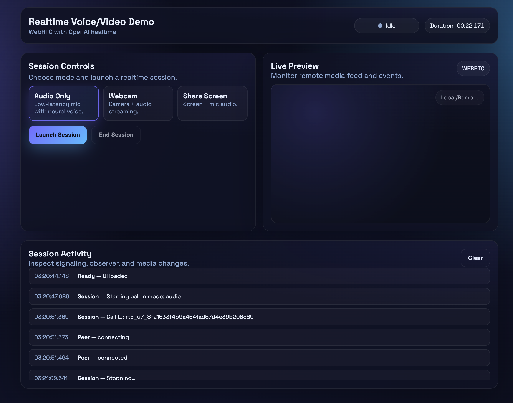

Lab 3: WebRTC + Video/Voice Agent with the Realtime API
Ship a browser + voice agent with video framework end-to-end

Build a full-stack voice experience: a WebRTC web client, a Hono-based backend, and optional SIP telephony with webhook verification. All files are provided in full so you can copy/paste and run.
Lab type

Guided build

Duration

~60 minutes

Level

Intermediate

Environment

Node.js 18+ + browser

Language

TypeScript

Focus

Realtime API + WebRTC + SDP

Jump to

Overview
Prerequisites
Env vars
Project setup
Frontend
Backend routes
Run & test
Troubleshooting
Extension challenges
1. Overview
This lab creates Realtime Voice Agent demo with clear, reproducible steps. You will ship a browser-based WebRTC client, a Hono backend that proxies the OpenAI Realtime API, and an optional SIP webhook so phone calls can reach your agent. All files are shown in full for copy/paste. The Realtime API streams audio to and from a model (for example, gpt-realtime) with very low latency, making it ideal for live dialogue. Browsers use WebRTC for audio transport; phones use SIP trunks that translate telephone audio into the realtime stream.
Realtime transport layers
WebRTC (browser): Handles mic/speaker setup and bidirectional audio streaming directly in the browser.
SIP (telephony): A SIP trunk (for example, Twilio or Bandwidth) forwards calls to OpenAI’s SIP endpoint. Your webhook receives the call event, creates a realtime session, and passes the call_id so audio flows through the phone network.
Agents SDK quick recipe
Create a project: Initialize a TS/JS app and install @openai/agents plus zod.
Generate an ephemeral client key: From your server, call /v1/realtime/client_secrets to get an ek_... key just-in-time for the browser.
Instantiate a RealtimeAgent: Give it a name and concise instructions to define persona and tone.
Create a RealtimeSession: Link it to the agent; the SDK picks WebRTC in the browser.
Connect and stream: Call session.connect() with the client key; mic access starts streaming and responses play through the speaker.
Handle tool calls (optional): Add tools and handle tool_calls events on the server to return results the model can speak.
2. Prerequisites
Node.js 18.18+ and a browser with microphone access.
OpenAI Realtime API access and an API key.
Optional: an OpenAI telephony number configured for SIP webhooks.
Comfort running shell commands.
3. Required environment variables
Set these before running

OPENAI_API_KEY – your Realtime API key (required).
OPENAI_SIGNING_SECRET – webhook signing secret for SIP (required if handling phone calls).
FROM_NUMBER – optional default outbound number tied to your OpenAI telephony setup.
PORT – optional server port (default 8000).
4. Project setup
Initialize a workspace
mkdir realtime-voice && cd realtime-voice
npm init -y
Install dependencies
npm install hono ws svix
npm install -D typescript ts-node @types/node @types/ws
Add a basic tsconfig.json
{
"compilerOptions": {
  "target": "ES2020",
  "module": "CommonJS",
  "moduleResolution": "Node",
  "esModuleInterop": true,
  "strict": true,
  "outDir": "dist",
  "types": ["node"]
},
"include": ["**/*.ts", "**/*.tsx"]
}
Create folders: frontend/ and routes/.
5. Frontend: WebRTC client
Place this in frontend/index.html. It requests mic access, starts/stops calls, and plays streamed audio.
<!DOCTYPE html>
<html lang="en">
<head>
  <meta charset="utf-8" />
  <meta name="viewport" content="width=device-width, initial-scale=1" />
  <title>Realtime Video Demo</title>
  <link rel="preconnect" href="https://fonts.googleapis.com">
  <link rel="preconnect" href="https://fonts.gstatic.com" crossorigin>
  <link href="https://fonts.googleapis.com/css2?family=Space+Grotesk:wght@400;500;600&display=swap" rel="stylesheet">
  
</head>
<body>
  

    

      

        
Realtime Voice/Video Demo

        
WebRTC with OpenAI Realtime

      

      

        Idle
        Duration 00:00.000
      

    

    

      

        <h3 style="margin:0 0 4px 0;">Session Controls</h3>
        
Choose mode and launch a realtime session.

        

          

            <strong>Audio Only</strong>
            <small style="color:var(--muted); display:block;">Low-latency mic with neural voice.</small>
          

          

            <strong>Webcam</strong>
            <small style="color:var(--muted); display:block;">Camera + audio streaming.</small>
          

          

            <strong>Share Screen</strong>
            <small style="color:var(--muted); display:block;">Screen + mic audio.</small>
          

        

        

          <button id="start" class="primary">Launch Session</button>
          <button id="stop" class="ghost" disabled>End Session</button>
        

      

      

        

          

            <h3 style="margin:0;">Live Preview</h3>
            
Monitor remote media feed and events.

          

          WEBRTC
        

        

          Local/Remote
          <video id="remoteVideo" autoplay playsinline muted></video>
        

      

    

    

      

        

          <h3 style="margin:0;">Session Activity</h3>
          
Inspect signaling, observer, and media changes.

        

        <button id="clear-log" class="ghost">Clear</button>
      

      

    

  

  <audio id="remoteAudio" autoplay playsinline></audio>

  
</body>
</html>
6. Backend: Hono server + routes
Place these files as shown; they run end-to-end when env vars are set. For a richer UX, add a status panel in React that shows WebRTC connection state, session ID, and recent events for easier debugging.
6.1 main.ts
import { Hono } from "hono";
import { readFile } from "fs/promises";
import path from "path";
import rtc from "./routes/rtc";
import observer from "./routes/observer";
import { serve } from "@hono/node-server";

const app = new Hono();
app.route("/rtc", rtc);
app.route("/observer", observer);

app.get("/", async (c) => {
  const filePath = path.join(process.cwd(), "frontend", "index.html");
  const html = await readFile(filePath, "utf8");
  return c.html(html);
});

const PORT = process.env.PORT || 8000;
console.log(`Server listening on http://localhost:${PORT}`);
serve({ fetch: app.fetch, port: Number(PORT) });
6.2 routes/observer.ts
import { Hono } from "hono";
import { readFile } from "fs/promises";
import path from "path";
import rtc from "./routes/rtc";
import observer from "./routes/observer";
import { serve } from "@hono/node-server";

const app = new Hono();
app.route("/rtc", rtc);
app.route("/observer", observer);

app.get("/", async (c) => {
  const filePath = path.join(process.cwd(), "frontend", "index.html");
  const html = await readFile(filePath, "utf8");
  return c.html(html);
});

const PORT = process.env.PORT || 8000;
console.log(`Server listening on http://localhost:${PORT}`);
serve({ fetch: app.fetch, port: Number(PORT) });
6.3 routes/rtc.ts
import { Hono } from "hono";
import { makeHeaders, makeSession, getErrorText } from "./utils";

const rtc = new Hono();

rtc.post("/", async (c) => {
  const url = new URL(c.req.url);
  const video = url.searchParams.get("video") === "true";
  const sdp = await c.req.text();
  if (!sdp) return c.text("Missing SDP offer", 400);

  const fd = new FormData();
  fd.set("sdp", sdp);
  fd.set("session", JSON.stringify(makeSession(video)));

  const upstream = await fetch("https://api.openai.com/v1/realtime/calls", {
    method: "POST",
    headers: makeHeaders(),
    body: fd,
  });
  if (!upstream.ok) {
    const err = await getErrorText(upstream);
    console.error("start call failed", err);
    return c.text(err, upstream.status as any);
  }

  const answer = upstream.body;
  const location = upstream.headers.get("location");
  const headers: Record<string, string> = {
    "Content-Type": upstream.headers.get("content-type") || "application/sdp",
  };
  if (location) {
    headers["Location"] = location;
    const callId = location.split("/").pop();
    if (callId) {
      const origin = new URL(c.req.url).origin;
      fetch(`${origin}/observer/${callId}`, { method: "POST" }).catch(() => {});
    }
  }
  return c.newResponse(answer, { headers });
});

rtc.post("/:callId/:action", async (c) => {
  const { callId, action } = c.req.param();
  const resp = await fetch(`https://api.openai.com/v1/realtime/calls/${callId}/${action}`, {
    method: "POST",
    headers: makeHeaders(),
  });
  if (!resp.ok) return c.text(await getErrorText(resp), resp.status as any);
  return c.text("ok");
});

export default rtc;
6.4 routes/utils.ts
const MODEL = "gpt-realtime";
const VOICE = "marin";
const INSTRUCTIONS = `Greet the user in English. Keep replies brief and conversational.`;

const OPENAI_API_KEY = process.env.OPENAI_API_KEY;
if (!OPENAI_API_KEY) {
  throw new Error("OpenAI API key not configured");
}

export function makeHeaders(contentType?: string): Record<string, string> {
  const headers: Record<string, string> = { Authorization: `Bearer ${OPENAI_API_KEY}` };
  if (contentType) headers["Content-Type"] = contentType;
  return headers;
}

export function makeSession(_video?: boolean) {
  return {
    type: "realtime",
    model: MODEL,
    instructions: INSTRUCTIONS,
    audio: {
      input: { noise_reduction: { type: "near_field" } },
      output: { voice: VOICE },
    },
  };
}

export async function getErrorText(resp: Response): Promise<string> {
  const body = await resp.text().catch(() => "<no body>");
  return `${resp.status} ${resp.statusText}: ${body}`;
}
7. Run & test
Create .env
OPENAI_API_KEY=sk-...
PORT=8000
Start the server
npm run dev
Open the UI at http://localhost:8000, allow microphone access, click Start, and speak. You should hear responses streamed back with minimal latency.
Try video flag: Start a session with ?video=true on the frontend to pass a video hint in the SDP and observe how the backend forwards it.
You should be able to run the demo locally and add more components to it.realtime_video

8. Troubleshooting
401/403 errors: Ensure OPENAI_API_KEY is set and has Realtime access.
SIP webhook failures: Check OPENAI_SIGNING_SECRET and verify the Svix headers are present.
No audio: Confirm mic permissions, inspect browser console for mixed content or websocket errors, and verify audio/mpeg playback.
TLS/ingress: For public SIP/web access, run behind HTTPS (e.g., via ngrok or a reverse proxy).
9. Extension challenges
Add a tool invocation path in createHandler to call functions (for example, weather lookup) via MCP.
Swap the TTS voice and model (voice.name, model) to compare latency and quality.
Persist transcripts and audio snippets to storage for later retrieval or analytics.
Deploy behind HTTPS with auth; use ngrok for local tunnels and a TLS reverse proxy (e.g., Nginx) in production. Set up automatic restarts using a process manager.
Add a simple React status panel to display connection state and recent events.
Configure a SIP trunk to forward calls to OpenAI’s SIP endpoint and, in your webhook, use the call_id to start a RealtimeSession that bridges phone audio to the model.
With the Realtime API hooked to WebRTC and SIP, you now have a template for browser and telephony voice agents you can adapt to any workflow.