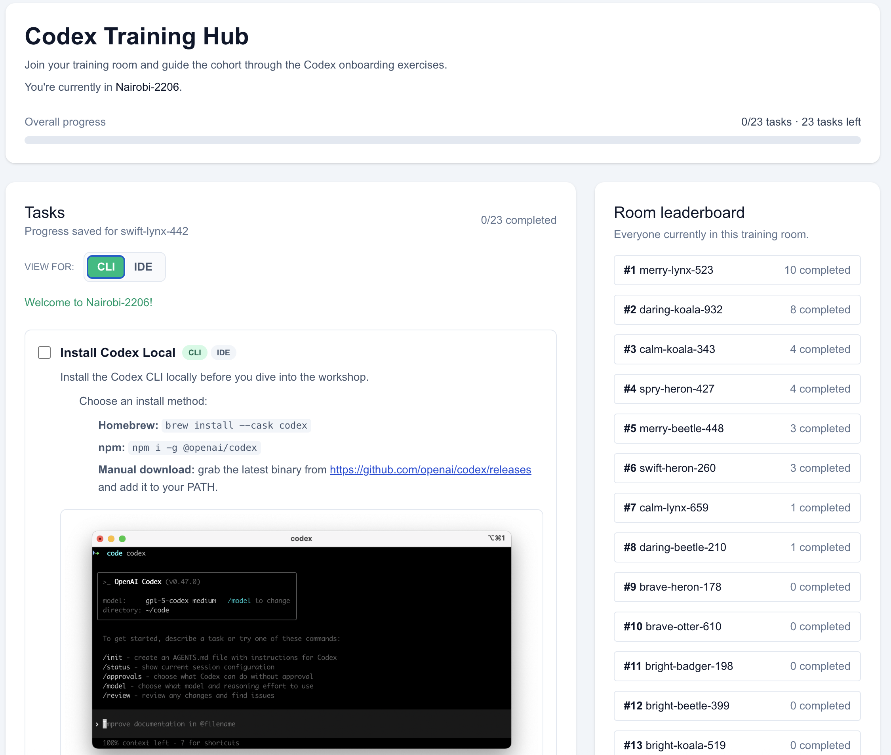

Codex Training Hub
Join your training room and run through the Codex onboarding exercises. Navigate to codex-102.vercel.app so you can review tasks directly inside the lab.
Room: Istanbul-4211
Progress: 0/23 tasks · 23 tasks left (example state shown)
View toggle: CLI | IDE (tasks adapt per surface)
Overview
Codex Training Hub: A Vercel app that delivers Codex onboarding tasks and room leaderboards.
Progress: Per-room and per-user counters (example: swift-lynx-442 with 0/23 completed).
Surfaces: Each task has CLI-only and IDE-only instructions. Use the toggle to see the appropriate steps.
Leaderboard: Shows room participants and completions (example: quick-koala-289 at 0 completed).

codex_training_hub
Tasks
Each task has CLI and IDE variants. Below is the embedded checklist; follow the CLI view unless you switch to IDE.
Install Codex Local — cli / ide
Install Codex CLI locally:
Homebrew: brew install --cask codex
npm: npm i -g @openai/codex
Manual: download the latest binary from https://github.com/openai/codex/releases and add it to your PATH.
Prep Codex on Windows — cli / ide
Follow the Windows guide: https://developers.openai.com/codex/windows.
Native quick start: install CLI, run from PowerShell. Agent mode uses experimental sandbox; cannot block writes where Everyone already has write access.
WSL2 (recommended): follow official docs.
Verify your Codex version — cli / ide
Run codex --version; expect at least codex-cli 0.53.0.
Sign in to Codex — cli / ide
Run codex login; complete browser sign-in with your ChatGPT account.
Get the reference repo — cli / ide
Clone: git clone https://github.com/openai/agents.md.git agents-md-repository
Start dev server:
cd agents-md-repository
npm install
npm run dev
Keep this terminal running; use a second terminal for Codex.
Change model reasoning effort — cli / ide
In Codex, run /model, select gpt-5.1-codex-max, choose Low reasoning.
Send a read-only prompt — cli / ide
Ask: “Explain what this repository is doing in short.” (with low reasoning model active).
Default to GPT-5.2 Codex Max (Medium) — cli / ide
Switch back to gpt-5.2-codex-max at Medium reasoning for subsequent tasks.
Create new files (assets) — cli / ide
Prompt: “Create a small HTML page in assets.html that shows how files are related to each others…”
Review the proposed asset before applying.
Prompt editing code — cli / ide
Prompt: “Add download and copy-as-markdown buttons next to Explore Examples and View on Github.”
Review diff before applying.
Send an image with instructions — cli / ide
Attach Agents.md textarea screenshot; ask: “Make inline background code chips orange.”
Verify styling update.
Resume a session — cli / ide
Run codex resume; find task “chip code/background orange”; ask “actually make that green.”
Confirm replay and update.
Connect the Cupcake MCP server — cli / ide
Read MCP overview: https://developers.openai.com/codex/mcp.
Add server:
codex mcp add cupcakemcp --url https://codex-102.vercel.app/mcp
codex mcp list
codex mcp get cupcake-mcp
Run MCP commands — cli
In a Codex chat, run /mcp to confirm connectivity. Fix config if needed.
Use Cupcake MCP results — cli / ide
Prompt: “Add a section that fetches Rachel order and show her cupcake order at the bottom of this webpage.”
Cupcake data: records.json#L260.
Add instructions to AGENTS.md — cli / ide
Append:
echo "When implementing new features or product requirements, fetch the latest context from available MCP servers (e.g. Cupcake orders) before coding." >> agents.md
Promote agents.md guidance globally — cli / ide
Move the new guidance to ~/.codex/agents.md; clean the project copy.
Prompt: “In which context would you use MCPs we have access to?” to confirm it sticks.
Try Codex search — cli / ide
Run:
codex --search "Add a small 'Latest News' footer box that links to a current article about Next.js 15. Include a date and source."
Pick the matching task; reopen if needed.
Create the add-tests command — cli
Save prompt in ~/.codex/prompts/add-tests.md:
Generate unit tests for the touched files. Use the project’s existing test runner and conventions. Keep diffs minimal and runnable locally.
Resume “Latest News” task; run /add-tests.
Share files and selections — cli / ide
Attach files via @file (e.g., @src/app/page.tsx) for context.
Use /review to spot a bug — cli / ide
Introduce a small bug (e.g., total++ in contributors loop).
Run /review against main; read findings.
Review prompting best practices — cli / ide
Read https://developers.openai.com/codex/prompting/.
Remember layered AGENTS.md: global, project, directory.
Review Codex resources — cli / ide
Docs hub: https://developers.openai.com/codex
SDK: https://developers.openai.com/codex/sdk
