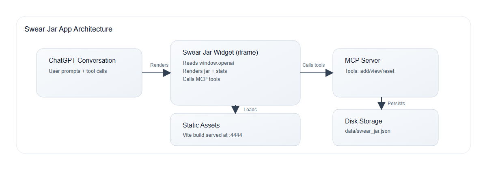
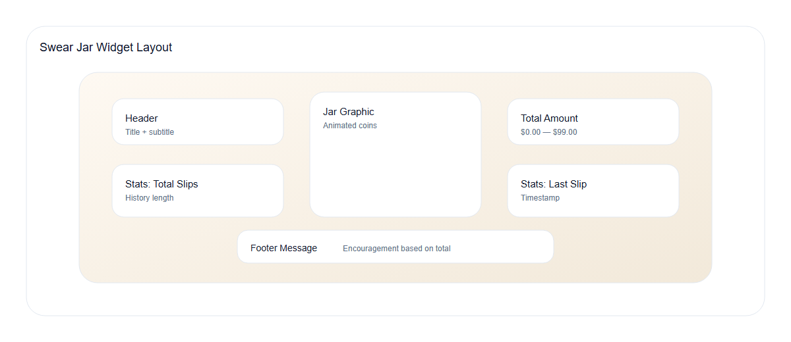
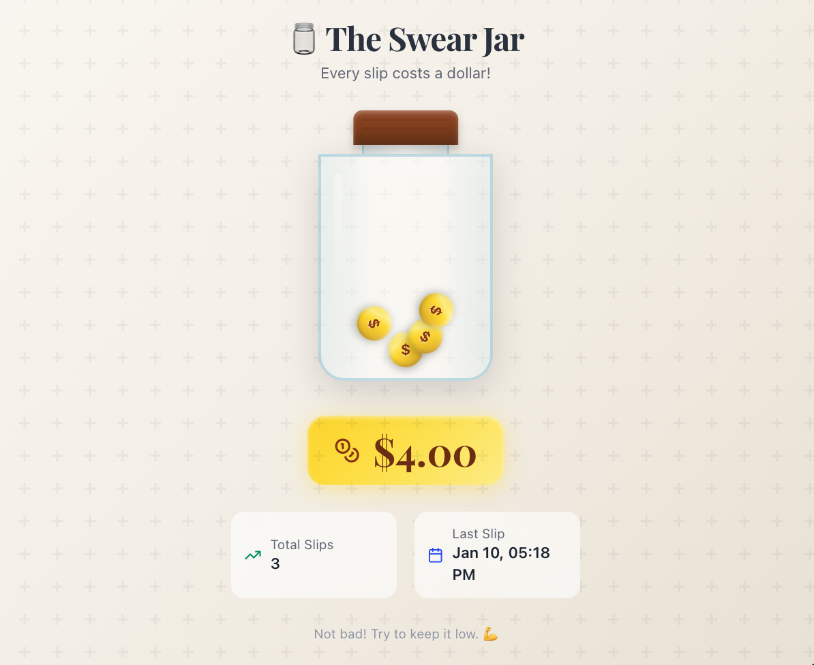

Swear Jar Chat App
Goal: A step-by-step, end-to-end lab for building a Swear Jar app inside ChatGPT. You will create a custom React widget, host it as a static asset, and power it with an MCP server that stores state on disk.
Completion Time: ~45 mins
What you'll build:
A React widget (src/swear-jar/) rendered inline via the Apps SDK
A Node MCP server (mcp_server/) that: exposes tools and a widget template serves your built widget assets (JS and CSS) returns structured data the widget reads
A Swear Jar experience with: animated UI and themed styling persisted jar history on disk tool-driven updates in ChatGPT
1) Purpose & Overview
This section frames the end-to-end goal so you understand the scope before building.
Build a React widget rendered inline in ChatGPT.
Create an MCP server with tools for add, view, and reset.
Persist jar history to disk and return structured data to the widget.
Run the full flow locally, then connect through ngrok.

Swear Jar architecture
2) Prerequisites
These tools and accounts ensure the build, dev server, and MCP host run smoothly.
Node.js 20+ (or 18+ if your environment already supports it)
pnpm (recommended): npm i -g pnpm
Python 3.11+
ngrok account + CLI installed
3) Setup (Setup.md)
This section initializes the project and wires up the tooling used throughout the lab.
This step sets up the project directory, tooling, and build scripts.
3.1 Create the project folder
Create a dedicated workspace so paths and scripts stay consistent later on.
mkdir swear-jar
cd swear-jar
3.2 Create package.json
Define the scripts and dependencies so installs and builds are reproducible.
{
  "name": "swear-jar",
  "version": "1.0.0",
  "description": "A SwearJar app for ChatGPT - track your swear jar contributions",
  "type": "module",
  "scripts": {
    "build": "tsx ./build.mts",
    "serve": "serve -s ./assets -p 4444 --cors",
    "dev": "vite --config vite.config.mts"
  },
  "devDependencies": {
    "@tailwindcss/vite": "^4.1.11",
    "@types/node": "^22.0.0",
    "@types/react": "^19.1.0",
    "@types/react-dom": "^19.1.0",
    "@vitejs/plugin-react": "^4.5.0",
    "serve": "^14.2.4",
    "tailwindcss": "^4.1.11",
    "tsx": "^4.20.0",
    "typescript": "^5.7.0",
    "vite": "^6.3.0"
  },
  "dependencies": {
    "framer-motion": "^12.0.0",
    "lucide-react": "^0.500.0",
    "react": "^19.1.0",
    "react-dom": "^19.1.0"
  }
}
3.3 Add TypeScript config
Configure strict typing and compiler behavior to match the Vite setup.
Create tsconfig.json:
{
  "compilerOptions": {
    "target": "ES2022",
    "useDefineForClassFields": true,
    "lib": ["ES2022", "DOM", "DOM.Iterable"],
    "module": "ESNext",
    "skipLibCheck": true,
    "moduleResolution": "bundler",
    "allowImportingTsExtensions": true,
    "resolveJsonModule": true,
    "isolatedModules": true,
    "noEmit": true,
    "jsx": "react-jsx",
    "strict": true,
    "noUnusedLocals": true,
    "noUnusedParameters": true,
    "noFallthroughCasesInSwitch": true,
    "esModuleInterop": true,
    "allowSyntheticDefaultImports": true
  },
  "include": ["src", "*.mts"]
}
3.4 Add Tailwind config
Set the design tokens and fonts the widget will use for its visual style.
Create tailwind.config.ts:
import type { Config } from "tailwindcss";

export default {
  content: ["./src/**/*.{js,ts,jsx,tsx}"],
  theme: {
    extend: {
      fontFamily: {
        display: ["Playfair Display", "Georgia", "serif"],
        sans: ["DM Sans", "system-ui", "sans-serif"],
      },
      colors: {
        jar: {
          glass: "#e8f4f8",
          lid: "#8b4513",
          coin: "#ffd700",
          accent: "#2d5016",
        },
      },
    },
  },
  plugins: [],
} satisfies Config;
3.5 Add Vite config
Wire React and Tailwind together and define the bundled output ChatGPT loads.
Create vite.config.mts:
import { defineConfig } from "vite";
import react from "@vitejs/plugin-react";
import tailwindcss from "@tailwindcss/vite";

export default defineConfig({
  plugins: [tailwindcss(), react()],
  server: {
    port: 4444,
    strictPort: true,
    cors: true,
  },
  esbuild: {
    jsx: "automatic",
    jsxImportSource: "react",
    target: "es2022",
  },
  build: {
    target: "es2022",
    outDir: "assets",
    sourcemap: true,
    minify: "esbuild",
    cssCodeSplit: false,
    rollupOptions: {
      input: "src/swear-jar/index.tsx",
      output: {
        format: "es",
        entryFileNames: "swear-jar.js",
        assetFileNames: "swear-jar.[ext]",
        inlineDynamicImports: true,
      },
    },
  },
});
3.6 Add the build script
Generate hashed assets and an HTML wrapper suitable for static hosting.
Create build.mts:
import { build } from "vite";
import react from "@vitejs/plugin-react";
import tailwindcss from "@tailwindcss/vite";
import path from "path";
import fs from "fs";
import crypto from "crypto";

const name = "swear-jar";
const outDir = "assets";
const entryFile = path.resolve("src/swear-jar/index.tsx");
const globalCss = path.resolve("src/index.css");

// Clean output directory
fs.rmSync(outDir, { recursive: true, force: true });
fs.mkdirSync(outDir, { recursive: true });

// Build configuration
const config = {
  plugins: [tailwindcss(), react()],
  esbuild: {
    jsx: "automatic" as const,
    jsxImportSource: "react",
    target: "es2022",
  },
  build: {
    target: "es2022",
    outDir,
    emptyOutDir: false,
    minify: "esbuild" as const,
    cssCodeSplit: false,
    rollupOptions: {
      input: entryFile,
      output: {
        format: "es" as const,
        entryFileNames: `${name}.js`,
        assetFileNames: `${name}.[ext]`,
        inlineDynamicImports: true,
      },
    },
  },
};

console.log(`Building ${name}...`);
await build(config);
console.log(`Built ${name}`);

// Generate version hash
const h = crypto.createHash("sha256").update(Date.now().toString()).digest("hex").slice(0, 4);

// Rename files with hash
const outputs = fs
  .readdirSync(outDir)
  .filter((f) => f.endsWith(".js") || f.endsWith(".css"))
  .map((f) => path.join(outDir, f));

for (const out of outputs) {
  const ext = path.extname(out);
  const base = path.basename(out, ext);
  const newName = path.join(outDir, `${base}-${h}${ext}`);
  fs.renameSync(out, newName);
  console.log(`${out} -> ${newName}`);
}

// Generate HTML files
const defaultBaseUrl = "http://localhost:4444";
const baseUrl = (process.env.BASE_URL?.trim() || defaultBaseUrl).replace(/\/+$/, "");

const html = `<!doctype html>
<html>
<head>
  <meta charset="utf-8">
  <meta name="viewport" content="width=device-width, initial-scale=1.0">
  
  <link rel="stylesheet" href="${baseUrl}/${name}-${h}.css">
</head>
<body>
  

</body>
</html>
`;

fs.writeFileSync(path.join(outDir, `${name}-${h}.html`), html);
fs.writeFileSync(path.join(outDir, `${name}.html`), html);
console.log(`Generated HTML files`);
console.log(`\nBuild complete! Hash: ${h}`);
console.log(`\nTo run:`);
console.log(`  1. pnpm run serve`);
console.log(`  2. uvicorn mcp_server.main:app --port 8000`);
Note: globalCss is declared so the build can be extended later; keep it as-is.
3.7 Install Node dependencies
Install everything before running builds or the dev server.
pnpm install
Checkpoint: You should now have package.json, tsconfig.json, tailwind.config.ts, vite.config.mts, and build.mts in the project root.
4) Frontend Widget (React_frontend.md)
This section builds the UI that ChatGPT renders and connects to your data.
This step builds the React widget that ChatGPT renders inside the app.
Note on widgets and _meta: The widget is the HTML/React UI ChatGPT renders inline. Tools return structuredContent, which the widget reads via window.openai.toolOutput, and the widget can call tools with window.openai.callTool(...). The _meta field on tools/resources passes host hints like which widget template to render (openai/outputTemplate) and whether the widget can invoke a tool (openai/widgetAccessible).
4.1 Create the front-end folder structure
Organize the widget entry point and related assets in a predictable place.
mkdir -p src/swear-jar
4.2 Add the widget entry file
Create the main React entry point and UI behavior for the jar experience.
Create src/swear-jar/index.tsx:
import "../index.css";
import { createRoot } from "react-dom/client";
import { motion, AnimatePresence } from "framer-motion";
import { useEffect, useState } from "react";
import { Coins, Sparkles, TrendingUp, Calendar } from "lucide-react";
import { useOpenAiGlobal } from "../use-openai-global";

interface SwearJarData {
  total: number;
  lastUpdated: string | null;
  history: Array<{
    amount: number;
    timestamp: string;
    reason?: string;
  }>;
}

function Coin({ delay, index }: { delay: number; index: number }) {
  const randomX = Math.sin(index * 2.5) * 30;
  const randomRotate = (index * 37) % 360;

  return (
    <motion.div
      initial={{ y: -100, opacity: 0, rotate: 0 }}
      animate={{
        y: 0,
        opacity: 1,
        rotate: randomRotate,
      }}
      transition={{
        delay: delay,
        type: "spring",
        stiffness: 200,
        damping: 15,
      }}
      style={{
        left: `calc(50% + ${randomX}px)`,
        bottom: `${10 + (index % 4) * 12}px`,
      }}
      className="absolute w-8 h-8 -translate-x-1/2"
    >
      

        {/* Coin face */}
        

        {/* Dollar sign */}
        
          $
        
      

    </motion.div>
  );
}

function JarGraphic({ coinCount }: { coinCount: number }) {
  const coinsToShow = Math.min(coinCount, 20);

  return (
    

      

        

        

      

      

      

        

        

          <AnimatePresence>
            {Array.from({ length: coinsToShow }).map((_, i) => (
              <Coin key={i} delay={i * 0.05} index={i} />
            ))}
          </AnimatePresence>
        

      

    

  );
}

function SparkleEffect() {
  return (
    <motion.div
      initial={{ opacity: 0, scale: 0.5 }}
      animate={{ opacity: [0, 1, 0], scale: [0.5, 1.2, 0.8] }}
      transition={{ duration: 0.8 }}
      className="absolute top-1/4 left-1/2 -translate-x-1/2 -translate-y-1/2"
    >
      <Sparkles className="w-12 h-12 text-yellow-400" />
    </motion.div>
  );
}

function SwearJarWidget() {
  const toolOutput = useOpenAiGlobal("toolOutput") as SwearJarData | null;
  const [showSparkle, setShowSparkle] = useState(false);
  const total = toolOutput?.total ?? 0;
  const lastUpdated = toolOutput?.lastUpdated ?? null;
  const historyCount = toolOutput?.history?.length ?? 0;

  useEffect(() => {
    if (total <= 0) return;
    setShowSparkle(true);
    const timer = setTimeout(() => setShowSparkle(false), 1500);
    return () => clearTimeout(timer);
  }, [total]);

  const formatDate = (dateStr: string | null | undefined) => {
    if (!dateStr) return "Never";
    try {
      return new Date(dateStr).toLocaleDateString(undefined, {
        month: "short",
        day: "numeric",
        hour: "2-digit",
        minute: "2-digit",
      });
    } catch {
      return "Unknown";
    }
  };

  return (
    

      

      <motion.div
        initial={{ opacity: 0, y: -20 }}
        animate={{ opacity: 1, y: 0 }}
        transition={{ duration: 0.5 }}
        className="text-center mb-6 relative z-10"
      >
        <h1
          className="text-3xl font-bold tracking-tight mb-1"
          style={{
            fontFamily: "'Playfair Display', Georgia, serif",
            color: "#2d3748",
          }}
        >
          🫙 The Swear Jar
        </h1>
        
Every slip costs a dollar!

      </motion.div>

      <motion.div
        initial={{ opacity: 0, scale: 0.9 }}
        animate={{ opacity: 1, scale: 1 }}
        transition={{ duration: 0.6, delay: 0.2 }}
        className="flex justify-center mb-6 relative"
      >
        <JarGraphic coinCount={total} />
        <AnimatePresence>
          {showSparkle && total > 0 && <SparkleEffect />}
        </AnimatePresence>
      </motion.div>

      <motion.div
        initial={{ opacity: 0, y: 20 }}
        animate={{ opacity: 1, y: 0 }}
        transition={{ duration: 0.5, delay: 0.4 }}
        className="text-center mb-6"
      >
        

          <Coins className="w-6 h-6 text-amber-800" />
          
            ${total.toFixed(2)}
          
        

      </motion.div>

      <motion.div
        initial={{ opacity: 0 }}
        animate={{ opacity: 1 }}
        transition={{ duration: 0.5, delay: 0.6 }}
        className="grid grid-cols-2 gap-4 max-w-xs mx-auto"
      >
        

          <TrendingUp className="w-4 h-4 text-emerald-600" />
          

            
Total Slips

            
{historyCount}

          

        

        

          <Calendar className="w-4 h-4 text-blue-600" />
          

            
Last Slip

            
{formatDate(lastUpdated)}

          

        

      </motion.div>

      <motion.p
        initial={{ opacity: 0 }}
        animate={{ opacity: 1 }}
        transition={{ duration: 0.5, delay: 0.8 }}
        className="text-center mt-6 text-xs text-gray-400"
      >
        {total === 0
          ? "Your jar is empty. Keep it clean! 🌟"
          : total < 10
            ? "Not bad! Try to keep it low. 💪"
            : total < 50
              ? "The jar is filling up... 😅"
              : "Yikes! That's a lot of quarters! 🙈"
        }
      </motion.p>
    

  );
}

const rootElement = document.getElementById("swear-jar-root");
if (rootElement) {
  createRoot(rootElement).render(<SwearJarWidget />);
}

export default SwearJarWidget;
4.3 Add base styles and fonts
Define global styles so the widget looks consistent and Tailwind utilities apply.
Create src/index.css:
@import url('https://fonts.googleapis.com/css2?family=Playfair+Display:wght@400;600;700&family=DM+Sans:wght@400;500;600&display=swap');

@import "tailwindcss";

* {
  box-sizing: border-box;
}

body {
  margin: 0;
  font-family: 'DM Sans', system-ui, sans-serif;
  -webkit-font-smoothing: antialiased;
  -moz-osx-font-smoothing: grayscale;
}
4.4 Add the OpenAI global helpers
Expose ChatGPT-provided APIs and context for the widget to call tools.
Create src/types.ts:
export type OpenAiGlobals<
  ToolInput = UnknownObject,
  ToolOutput = UnknownObject,
  ToolResponseMetadata = UnknownObject,
  WidgetState = UnknownObject
> = {
  // visuals
  theme: Theme;

  userAgent: UserAgent;
  locale: string;

  // layout
  maxHeight: number;
  displayMode: DisplayMode;
  safeArea: SafeArea;

  // state
  toolInput: ToolInput;
  toolOutput: ToolOutput | null;
  toolResponseMetadata: ToolResponseMetadata | null;
  widgetState: WidgetState | null;
  setWidgetState: (state: WidgetState) => Promise<void>;
};

// currently copied from types.ts in chatgpt/web-sandbox.
// Will eventually use a public package.
type API = {
  callTool: CallTool;
  sendFollowUpMessage: (args: { prompt: string }) => Promise<void>;
  openExternal(payload: { href: string }): void;

  // Layout controls
  requestDisplayMode: RequestDisplayMode;
  requestModal: (args: { title?: string; params?: UnknownObject }) => Promise<unknown>;
  requestClose: () => Promise<void>;
};

export type UnknownObject = Record<string, unknown>;

export type Theme = "light" | "dark";

export type SafeAreaInsets = {
  top: number;
  bottom: number;
  left: number;
  right: number;
};

export type SafeArea = {
  insets: SafeAreaInsets;
};

export type DeviceType = "mobile" | "tablet" | "desktop" | "unknown";

export type UserAgent = {
  device: { type: DeviceType };
  capabilities: {
    hover: boolean;
    touch: boolean;
  };
};

/** Display mode */
export type DisplayMode = "pip" | "inline" | "fullscreen";
export type RequestDisplayMode = (args: { mode: DisplayMode }) => Promise<{
  /**
   * The granted display mode. The host may reject the request.
   * For mobile, PiP is always coerced to fullscreen.
   */
  mode: DisplayMode;
}>;

export type CallToolResponse = {
  result: string;
};

/** Calling APIs */
export type CallTool = (
  name: string,
  args: Record<string, unknown>
) => Promise<CallToolResponse>;

/** Extra events */
export const SET_GLOBALS_EVENT_TYPE = "openai:set_globals";
export class SetGlobalsEvent extends CustomEvent<{
  globals: Partial<OpenAiGlobals>;
}> {
  readonly type = SET_GLOBALS_EVENT_TYPE;
}

/**
 * Global oai object injected by the web sandbox for communicating with chatgpt host page.
 */
declare global {
  interface Window {
    openai: API & OpenAiGlobals;
  }

  interface WindowEventMap {
    [SET_GLOBALS_EVENT_TYPE]: SetGlobalsEvent;
  }
}
Create src/use-openai-global.ts:
import { useSyncExternalStore } from "react";
import {
  SET_GLOBALS_EVENT_TYPE,
  SetGlobalsEvent,
  type OpenAiGlobals,
} from "./types";

export function useOpenAiGlobal<K extends keyof OpenAiGlobals>(
  key: K
): OpenAiGlobals[K] | null {
  return useSyncExternalStore(
    (onChange) => {
      if (typeof window === "undefined") {
        return () => {};
      }

      const handleSetGlobal = (event: SetGlobalsEvent) => {
        const value = event.detail.globals[key];
        if (value === undefined) {
          return;
        }

        onChange();
      };

      window.addEventListener(SET_GLOBALS_EVENT_TYPE, handleSetGlobal, {
        passive: true,
      });

      return () => {
        window.removeEventListener(SET_GLOBALS_EVENT_TYPE, handleSetGlobal);
      };
    },
    () => window.openai?.[key] ?? null,
    () => window.openai?.[key] ?? null
  );
}
Checkpoint: You should now have src/swear-jar/index.tsx, src/index.css, src/types.ts, and src/use-openai-global.ts in place.
Swear Jar widget layout

5) MCP Server
This step builds the MCP server that powers the tools and serves the widget HTML.
5.1 Create the server folder
Keep server code isolated so it is easy to run and extend.
mkdir -p mcp_server
5.2 Add Python dependencies
Install the MCP and web server libraries required to run the backend.
Create mcp_server/requirements.txt:
fastapi>=0.115.0
mcp[cli]>=0.1.0
uvicorn>=0.30.0
pydantic>=2.0.0
starlette>=0.40.0
5.3 Add a small package marker
Make the server folder importable for clean Python module resolution.
Create mcp_server/__init__.py:
# SwearJar MCP Server
5.4 Add the MCP server implementation
Implement the MCP tools that the widget uses to add and read data.
Create mcp_server/main.py:
"""SwearJar MCP server - tracks contributions with persistence."""

from __future__ import annotations

import hashlib
import json
import time
from datetime import datetime, timezone
from pathlib import Path
from typing import Any, Dict, List, Tuple

import mcp.types as types
from mcp.server.fastmcp import FastMCP
from mcp.server.transport_security import TransportSecuritySettings
from pydantic import BaseModel, Field

TOOL_NAME = "add_to_swear_jar"
WIDGET_TEMPLATE_URI = "ui://widget/swear-jar.html"
WIDGET_TITLE = "Swear Jar"
MIME_TYPE = "text/html+skybridge"

# ChatGPT loads the widget once, then asks for permission and loads the widget again.
# This causes duplicate requests to the MCP server.
# This window is used to deduplicate these requests.
# If a request is made within this window, the response is returned immediately without
# making the actual tool call.
IDEMPOTENCY_WINDOW_SECONDS = 10

ASSETS_DIR = Path(__file__).resolve().parent.parent / "assets"
DATA_DIR = Path(__file__).resolve().parent / "data"
DATA_FILE = DATA_DIR / "swear_jar.json"

def _ensure_data_dir():
    """Ensure data directory exists."""
    DATA_DIR.mkdir(parents=True, exist_ok=True)

def _load_widget_html() -> str:
    """Load the widget HTML from assets."""
    paths = [ASSETS_DIR / "swear-jar.html", *sorted(ASSETS_DIR.glob("swear-jar-*.html"))]
    for path in paths:
        if path.exists():
            return path.read_text(encoding="utf8")
    raise FileNotFoundError(
        f'Widget HTML for "swear-jar" not found in {ASSETS_DIR}. '
        "Run `pnpm run build` to generate the assets before starting the server."
    )

SWEAR_JAR_HTML = _load_widget_html()

class SwearJarData(BaseModel):
    """Persistent swear jar data."""

    total: float = 0.0
    last_updated: str | None = None
    history: List[Dict[str, Any]] = Field(default_factory=list)

def _load_jar_data() -> SwearJarData:
    """Load swear jar data from disk."""
    _ensure_data_dir()
    if DATA_FILE.exists():
        try:
            data = json.loads(DATA_FILE.read_text(encoding="utf8"))
            return SwearJarData(**data)
        except Exception:
            return SwearJarData()
    return SwearJarData()

def _save_jar_data(data: SwearJarData):
    """Save swear jar data to disk."""
    _ensure_data_dir()
    DATA_FILE.write_text(
        json.dumps(data.model_dump(), indent=2, ensure_ascii=False),
        encoding="utf8"
    )

class AddToJarInput(BaseModel):
    """Input for adding to the swear jar."""

    amount: float = Field(
        default=1.0,
        ge=0.01,
        description="Amount in dollars to add to the jar. Defaults to $1."
    )
    reason: str | None = Field(
        default=None,
        description="Optional reason for the contribution (e.g., 'said a bad word')."
    )

TOOL_INPUT_SCHEMA = AddToJarInput.model_json_schema()

_idempotency_cache: Dict[str, Tuple[float, types.ServerResult]] = {}

def _compute_request_hash(tool_name: str, args: Dict[str, Any]) -> str:
    """Compute a hash for the request to use as idempotency key."""
    payload = json.dumps({"tool": tool_name, "args": args}, sort_keys=True)
    return hashlib.sha256(payload.encode()).hexdigest()[:16]

def _check_idempotency(request_hash: str) -> types.ServerResult | None:
    """Check if we've recently processed this exact request."""
    now = time.time()
    expired = [k for k, (ts, _) in _idempotency_cache.items()
               if now - ts > IDEMPOTENCY_WINDOW_SECONDS]
    for k in expired:
        del _idempotency_cache[k]
    if request_hash in _idempotency_cache:
        ts, response = _idempotency_cache[request_hash]
        if now - ts <= IDEMPOTENCY_WINDOW_SECONDS:
            return response

    return None

def _cache_response(request_hash: str, response: types.ServerResult):
    """Cache a response for idempotency."""
    _idempotency_cache[request_hash] = (time.time(), response)

mcp = FastMCP(
    name="swear-jar-server",
    stateless_http=True,
    transport_security=TransportSecuritySettings(
        enable_dns_rebinding_protection=False,
    ),
)

def _widget_meta() -> Dict[str, Any]:
    """Return widget metadata for the Apps SDK."""
    return {
        "openai/outputTemplate": WIDGET_TEMPLATE_URI,
        "openai/toolInvocation/invoking": "Adding to swear jar...",
        "openai/toolInvocation/invoked": "Swear jar updated!",
        "openai/widgetAccessible": True,
    }

@mcp._mcp_server.list_tools()
async def _list_tools() -> List[types.Tool]:
    return [
        types.Tool(
            name=TOOL_NAME,
            title="Add to Swear Jar",
            description=(
                "Add money to the swear jar when the user swears or wants to make a contribution. "
                "Accepts an optional amount (defaults to $1) and an optional reason."
            ),
            inputSchema=TOOL_INPUT_SCHEMA,
            _meta=_widget_meta(),
        ),
        types.Tool(
            name="view_swear_jar",
            title="View Swear Jar",
            description="View the current state of the swear jar without adding any money.",
            inputSchema={"type": "object", "properties": {}},
            _meta=_widget_meta(),
        ),
        types.Tool(
            name="reset_swear_jar",
            title="Reset Swear Jar",
            description="Empty the swear jar and start fresh. Use when the user wants to cash out or reset.",
            inputSchema={"type": "object", "properties": {}},
            _meta=_widget_meta(),
        ),
    ]

@mcp._mcp_server.list_resources()
async def _list_resources() -> List[types.Resource]:
    return [
        types.Resource(
            name=WIDGET_TITLE,
            title=WIDGET_TITLE,
            uri=WIDGET_TEMPLATE_URI,
            description="Markup for the swear jar widget.",
            mimeType=MIME_TYPE,
            _meta=_widget_meta(),
        )
    ]

async def _handle_read_resource(req: types.ReadResourceRequest) -> types.ServerResult:
    """Handle resource read requests."""
    if str(req.params.uri) != WIDGET_TEMPLATE_URI:
        return types.ServerResult(
            types.ReadResourceResult(
                contents=[],
                _meta={"error": f"Unknown resource: {req.params.uri}"},
            )
        )

    contents = [
        types.TextResourceContents(
            uri=WIDGET_TEMPLATE_URI,
            mimeType=MIME_TYPE,
            text=SWEAR_JAR_HTML,
            _meta=_widget_meta(),
        )
    ]
    return types.ServerResult(types.ReadResourceResult(contents=contents))

def _build_response(jar_data: SwearJarData, message: str) -> types.ServerResult:
    """Build a tool response with the swear jar data."""
    structured_content = {
        "total": jar_data.total,
        "lastUpdated": jar_data.last_updated,
        "history": jar_data.history[-10:],  # Last 10 entries
    }

    return types.ServerResult(
        types.CallToolResult(
            content=[types.TextContent(type="text", text=message)],
            structuredContent=structured_content,
            _meta=_widget_meta(),
        )
    )

async def _handle_call_tool(req: types.CallToolRequest) -> types.ServerResult:
    """Handle tool calls with idempotency protection."""
    tool_name = req.params.name
    args = req.params.arguments or {}

    if tool_name in (TOOL_NAME, "reset_swear_jar"):
        request_hash = _compute_request_hash(tool_name, args)
        cached = _check_idempotency(request_hash)
        if cached is not None:
            return cached

    jar_data = _load_jar_data()

    if tool_name == TOOL_NAME:
        try:
            payload = AddToJarInput.model_validate(args)
        except Exception as exc:
            return types.ServerResult(
                types.CallToolResult(
                    content=[types.TextContent(type="text", text=f"Invalid input: {exc}")],
                    isError=True,
                )
            )

        now = datetime.now(timezone.utc).isoformat()
        jar_data.total += payload.amount
        jar_data.last_updated = now
        jar_data.history.append({
            "amount": payload.amount,
            "timestamp": now,
            "reason": payload.reason,
        })

        _save_jar_data(jar_data)

        message = f"Added ${payload.amount:.2f} to the swear jar. Total is now ${jar_data.total:.2f}."
        if payload.reason:
            message += f" Reason: {payload.reason}"

        response = _build_response(jar_data, message)
        _cache_response(request_hash, response)
        return response

    if tool_name == "view_swear_jar":
        if jar_data.total == 0:
            message = "The swear jar is empty! Keep it clean! 🌟"
        else:
            message = f"The swear jar contains ${jar_data.total:.2f} from {len(jar_data.history)} contribution(s)."
        return _build_response(jar_data, message)

    if tool_name == "reset_swear_jar":
        old_total = jar_data.total
        jar_data = SwearJarData()
        _save_jar_data(jar_data)

        message = f"The swear jar has been emptied! You collected ${old_total:.2f}. Starting fresh!"
        response = _build_response(jar_data, message)
        _cache_response(request_hash, response)
        return response

    return types.ServerResult(
        types.CallToolResult(
            content=[types.TextContent(type="text", text=f"Unknown tool: {tool_name}")],
            isError=True,
        )
    )

mcp._mcp_server.request_handlers[types.CallToolRequest] = _handle_call_tool
mcp._mcp_server.request_handlers[types.ReadResourceRequest] = _handle_read_resource

app = mcp.streamable_http_app()

try:
    from starlette.middleware.cors import CORSMiddleware

    app.add_middleware(
        CORSMiddleware,
        allow_origins=["*"],
        allow_methods=["*"],
        allow_headers=["*"],
        allow_credentials=False,
    )
except Exception:
    pass

if __name__ == "__main__":
    import uvicorn
    uvicorn.run(app, host="0.0.0.0", port=8000)
Checkpoint: You should now have mcp_server/main.py and mcp_server/requirements.txt.
6) Run + Connect (RUN_Connect.md)
This section runs everything locally and connects it to ChatGPT via ngrok.
This step builds the widget, starts the servers, and connects ChatGPT to the MCP server.
6.1 Install Python dependencies
Install backend deps before launching the MCP server.
python -m venv .venv
source .venv/bin/activate
pip install -r mcp_server/requirements.txt
6.2 Build the widget assets
Generate the static files that will be served to ChatGPT.
pnpm run build
Expected output:
assets/ contains swear-jar.html, a hashed HTML file, and JS/CSS bundles.
6.3 Serve the widget assets
Host the built widget locally so ChatGPT can load it.
pnpm run serve
Expected output:
Static assets are available at http://localhost:4444.
6.4 Start the MCP server
Launch the tool server that powers the widget's actions.
Open a new terminal and run:
source .venv/bin/activate
uvicorn mcp_server.main:app --port 8000
Expected output:
Server is running at http://localhost:8000/mcp.
6.5 Expose the MCP server with ngrok
Create a public URL that ChatGPT can reach.
Open another terminal and run:
ngrok http 8000
Copy the https://... forwarding URL from ngrok (not the http:// one).
6.6 Connect to ChatGPT
Register the MCP endpoint so ChatGPT can call your tools.
Enable Developer Mode in ChatGPT.
Go to Settings → Apps.
Add your MCP connector URL:
https://<your-ngrok-subdomain>.ngrok-free.app/mcp
Swear Jar widget in ChatGPT

6.7 Test the app in ChatGPT
Validate end-to-end behavior and confirm the UI updates.
Try these prompts:
"Add $1 to my swear jar"
"Show me my swear jar"
"Reset my swear jar"
Expected output:
The Swear Jar widget renders inline and updates after each tool call.
Troubleshooting
Use this section to resolve common setup or runtime hiccups.
If the server complains about missing HTML, make sure pnpm run build ran successfully and assets/ exists.
If the widget doesn't render, confirm the ngrok URL in ChatGPT ends with /mcp.
If you see CORS errors, ensure both pnpm run serve and uvicorn are running.
Challenges
These optional exercises help you extend the lab beyond the core build.
Add a "Reason" pill list to the widget that shows the last 3 reasons.
Add a new tool add_random_tip that adds a random $0.25, $0.50, or $1.00 with a message.
Update the MCP server to limit the history length to 50 items, but still return only the last 10.
Add a "Streak" badge that shows days since the last slip (calculate from lastUpdated).
Add a "Clear history" tool that resets history but keeps the total.